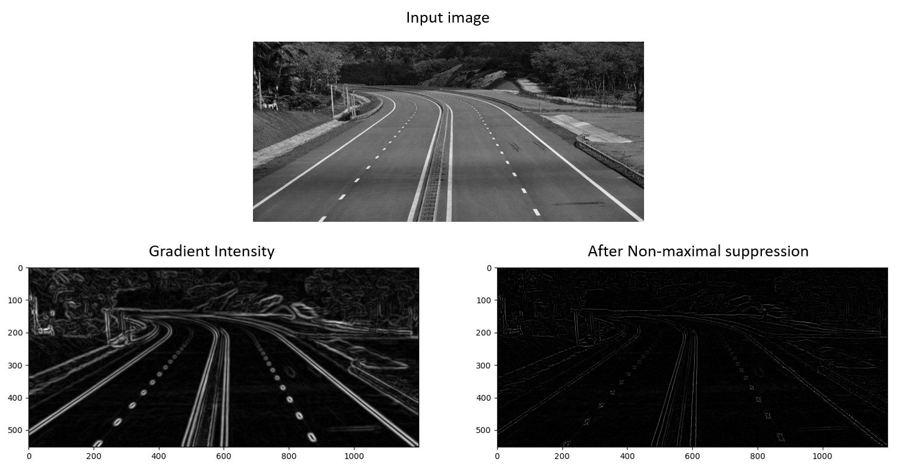
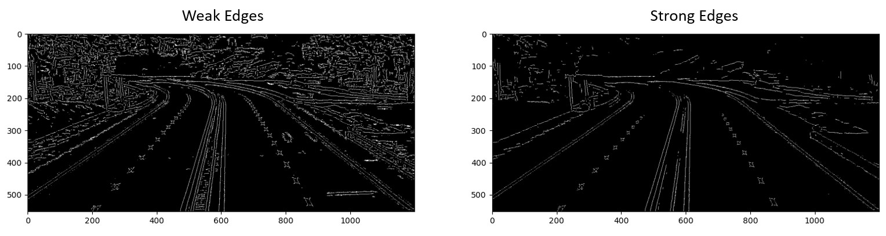
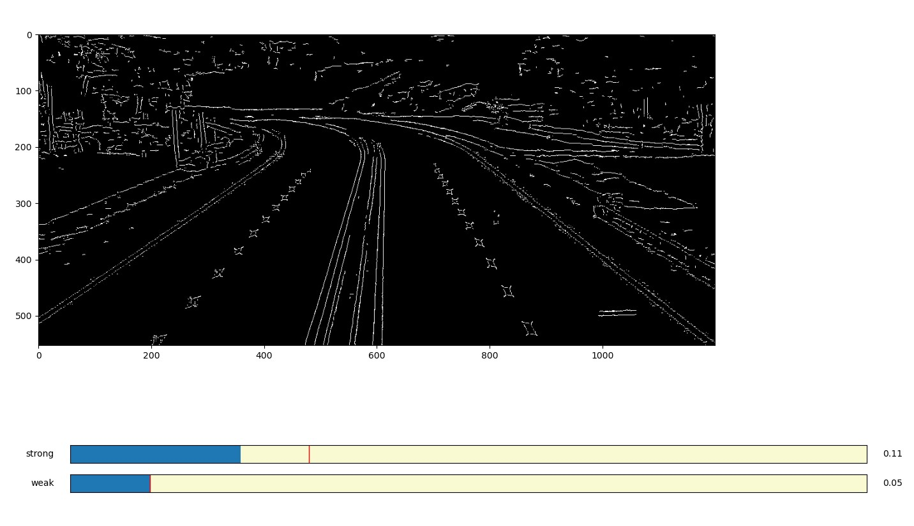

# canny-edge-detector
Python implementation for Canny Edge Detection algorithm, with interactive slider to manually adjust the thresholds.

Edge detection is necessary in a wide range of computer vision applications. Canny edge detector is an algorithm which addresses this. It works in 5 steps:
1. Reduce noise by smoothing the image (Gaussian Blur)
2. Compute intensity gradients of image. Edges are pixels where the intensity varies drastically, so we can find them by highlighting the intensity change in x and y directions)
3. Non-maximal suppression: Apply thresholding to get rid of non-edges which get detected as such.
4. Double threshold: To find all the potential edges. The thresholds are to be detected empirically on a case by case basis.
5. Edge tracking by hysteresis: Making connections between the weak and strong edges found by double thresholding.

References:
[Wikipedia](https://en.wikipedia.org/wiki/Canny_edge_detector)
[Towards Datascience](https://towardsdatascience.com/canny-edge-detection-step-by-step-in-python-computer-vision-b49c3a2d8123)
